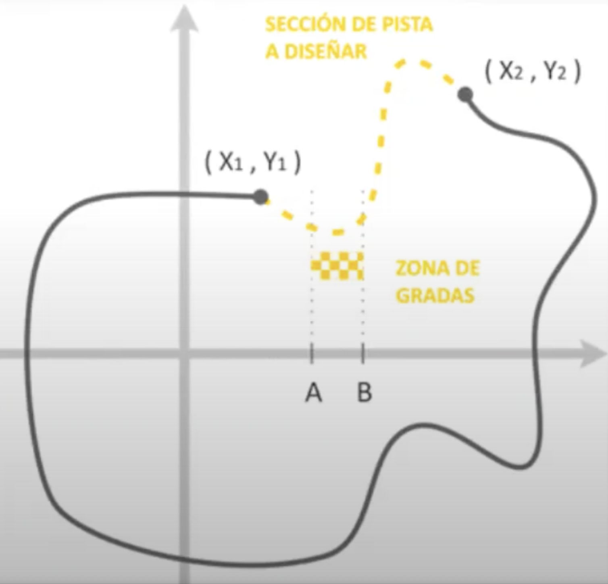
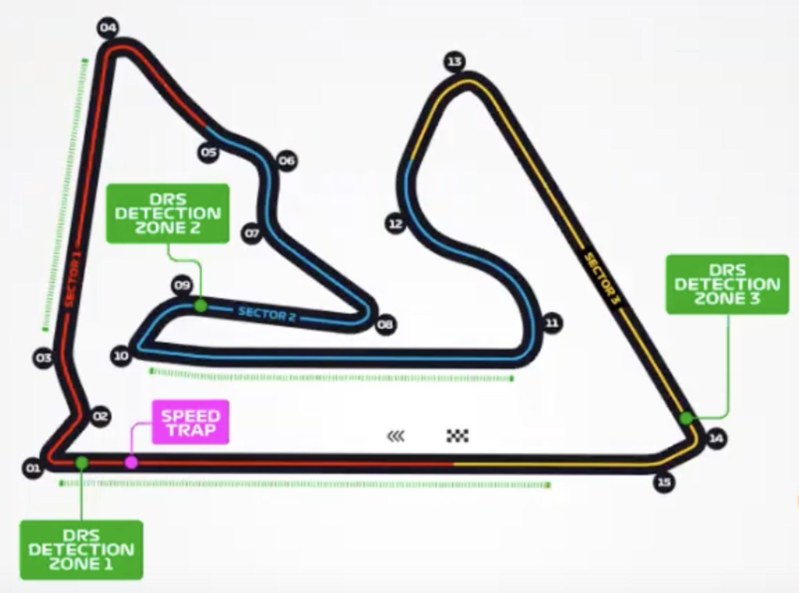
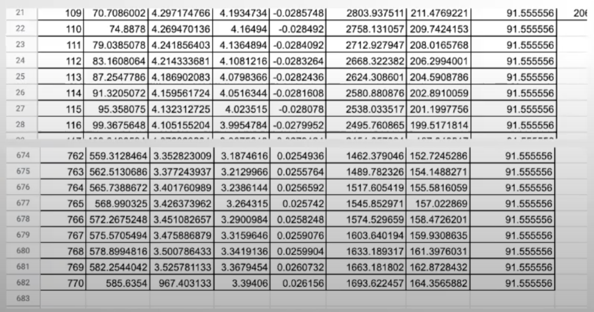
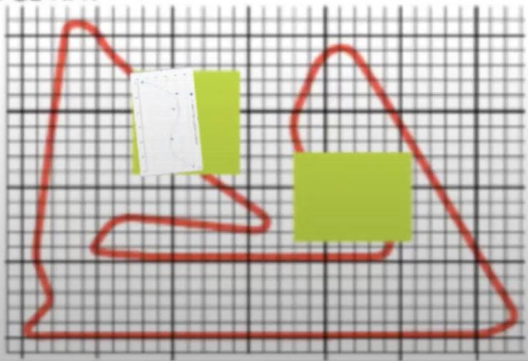
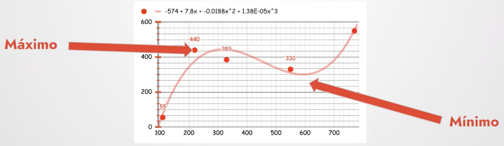
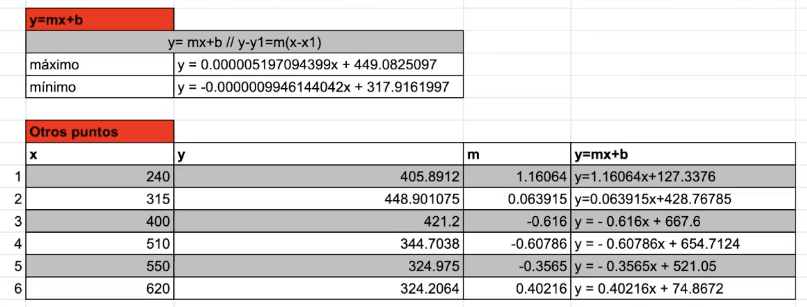
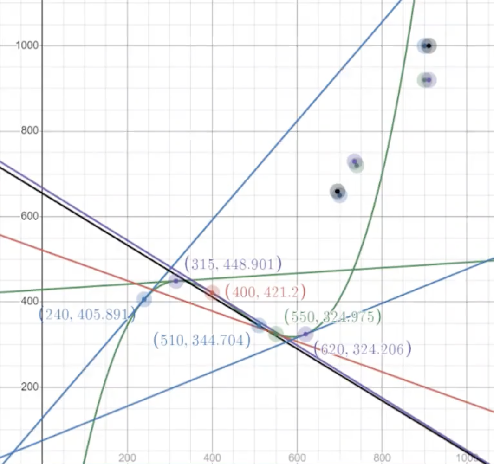
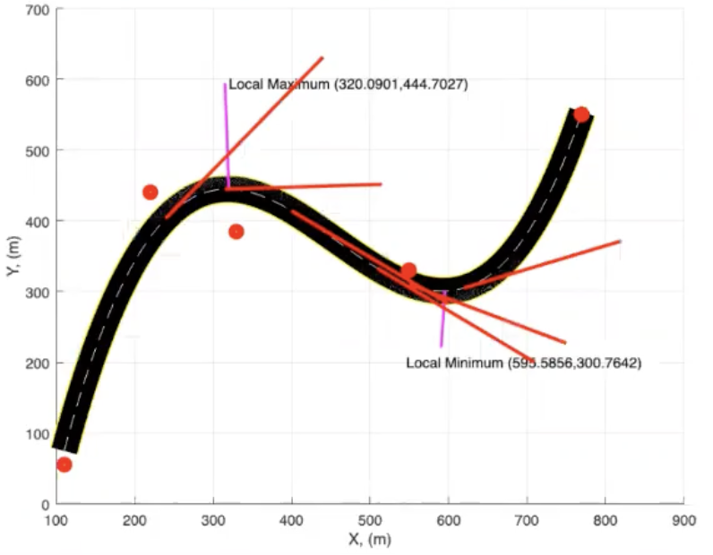
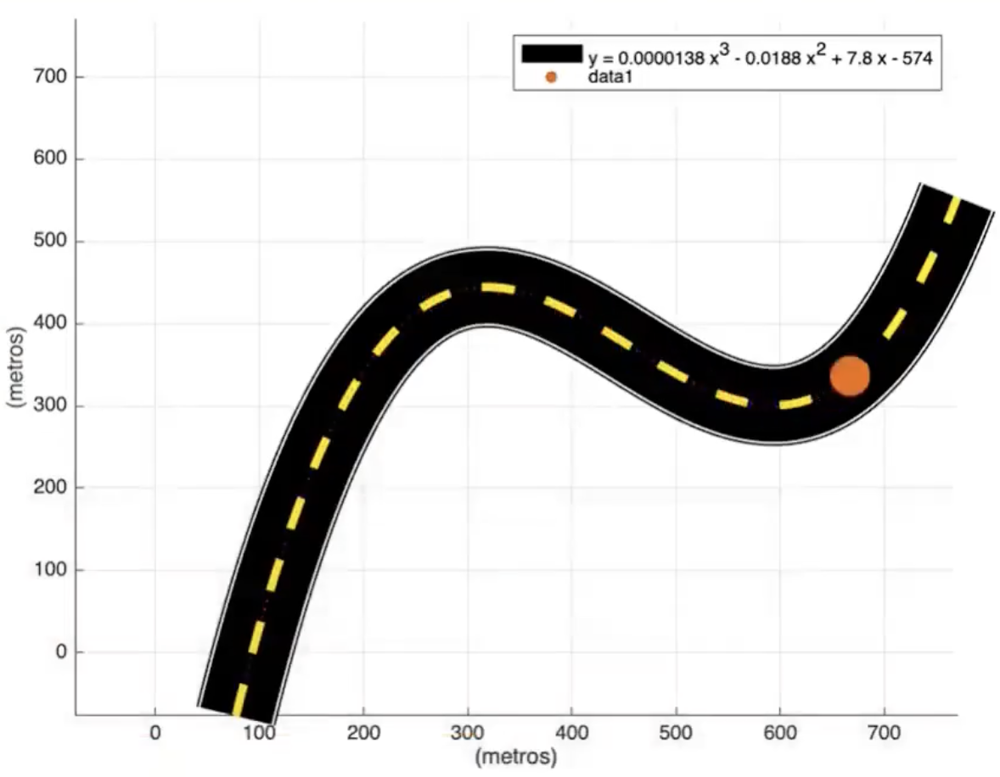

# **Location-of-grandstands-F1**
> *A computational simulation to determine optimal, safe, and exciting viewing locations for spectators in Formula One events.*

## **Introduction**
This project explores computational simulation to enhance Formula One spectator experiences by determining optimal locations for grandstands around the circuit. It considers safety and visibility factors, offering an innovative approach to grandstand placement on the Bahrain F1 circuit.

## **Project Description**
- **Main functionality:** Simulates the movement of an F1 car along a track and evaluates potential grandstand locations based on safety and visibility.
- **Technologies used:** MATLAB for simulation and computational analysis; Excel for data visualization and preliminary model creation.
- **Challenges faced:** Accurate simulation of real-world circuit dynamics, handling variables like friction, slope, and curvature.
- **Future improvements:** Expand to different circuits and integrate real-time data for dynamic grandstand positioning.

## **Table of Contents**
1. [Introduction](#introduction)
2. [Project Description](#project-description)
3. [Installation](#installation)
4. [Usage](#usage)
5. [Testing](#testing)
6. [License](#license)

## **Installation**
1. **Prerequisites**:
   - **MATLAB** - [Installation page](https://www.mathworks.com/products/matlab.html)

2. **Clone the repository**:
   ```bash
   git clone https://github.com/ivmg5/Location-Of-Grandstands-F1.git
   cd Location-Of-Grandstands-F1
   ```

3. **Open MATLAB and run**:
   Open `main.mlx` in MATLAB to execute the simulation.

### **Configuration Options**
   - Ensure MATLAB path settings include the project directory for seamless execution.
   - Adjust variables in `main.mlx` to modify simulation parameters, such as track width (`w`), car size (`h`), and the `curve` visualization.

## **Usage**
To simulate car movement and analyze grandstand placement:

1. Open `main.mlx` in MATLAB and run the script.
2. The simulation will plot the car's path on the track, indicating optimal grandstand positions.

**Example visualization**:
- The simulation illustrates a car following the track, with specific tangents representing critical viewpoints for spectators.

## **Images and Explanations**
Below are the visual assets used in the project, each with a description for context:

1. **Section of Track to be Designed and Grandstand Zone**:
   - This image highlights the missing section of the track design and the designated area where the grandstands should ideally be placed.
   

2. **Current Real Track**:
   - The actual layout of the Bahrain circuit is displayed, including DRS detection zones and sectors for reference.
   

3. **Table of Potential Grandstand Locations**:
   - A detailed table listing potential grandstand locations, with coordinates and other relevant metrics calculated during the analysis.
   

4. **Curve Design Overlaid on Real Track**:
   - The proposed curve design overlaid on the existing track layout, showing how the design fits into the real-world track.
   

5. **Maximum and Minimum Speeds on Curve**:
   - A plot indicating the maximum and minimum speeds achievable on the designed curve.
   

6. **Mathematical Calculations for Curve Design**:
   - A table with calculations, including formulas for tangent lines and gradients at specific points along the curve.
   

7. **Graph of Curve Design with Key Points**:
   - A graph displaying the curve design, highlighting maximum and minimum points, and the four corners for potential grandstand placement.
   

8. **MATLAB Plot of Curve Design**:
   - A MATLAB-generated plot showing the curve with maximum and minimum points highlighted, as well as the path of the vehicle.
   

9. **Simulation Output**:
   - The result of running the simulation in MATLAB, showing the path of the car along the designed curve and the grandstand positioning.
   

## **Testing**
Run MATLAB scripts within `main.mlx` to verify simulation accuracy:
```matlab
run('main.mlx')
```

## **License**
This project is licensed under the MIT License.

[](#)
